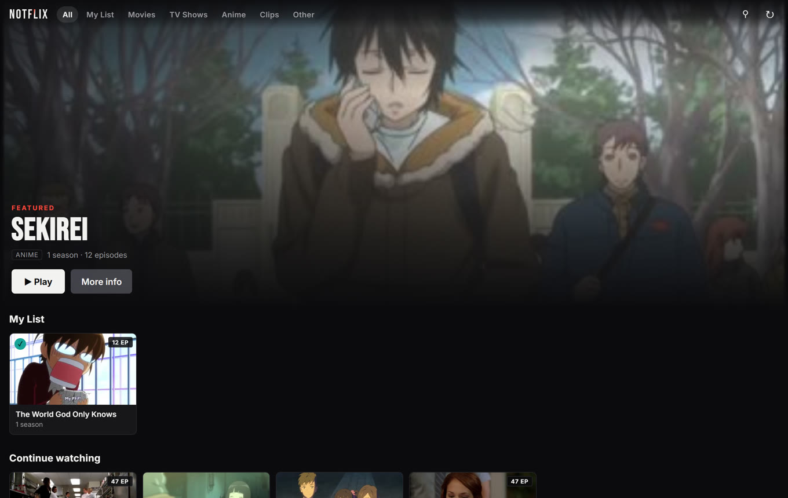
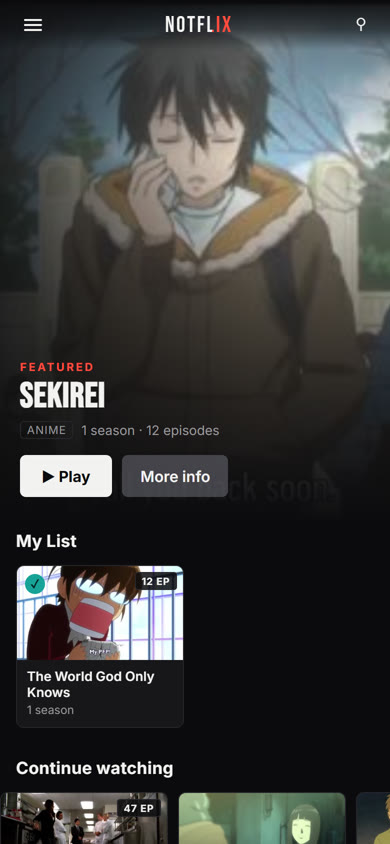
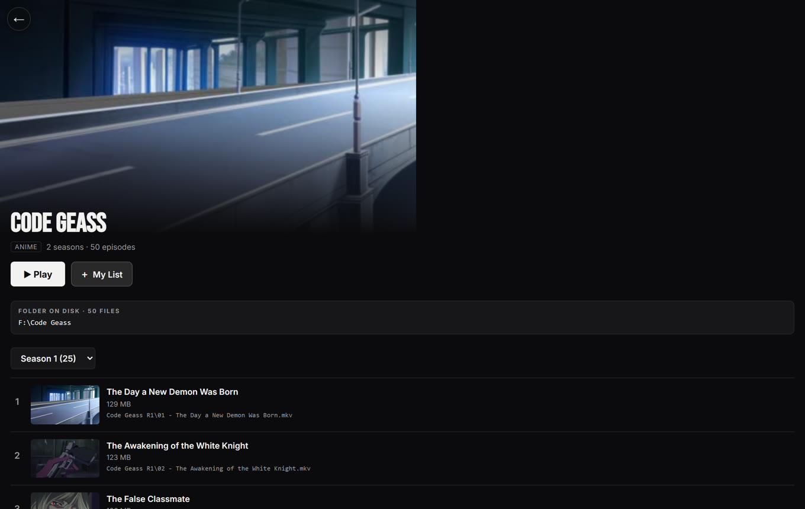
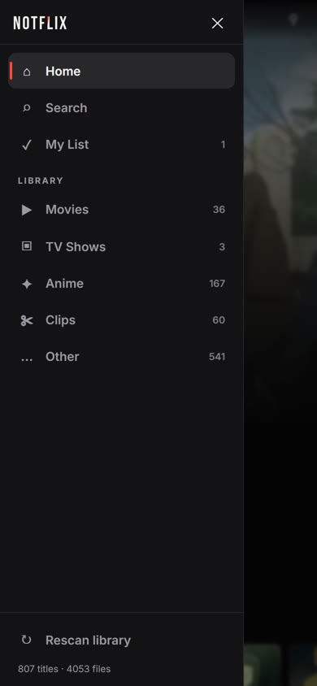
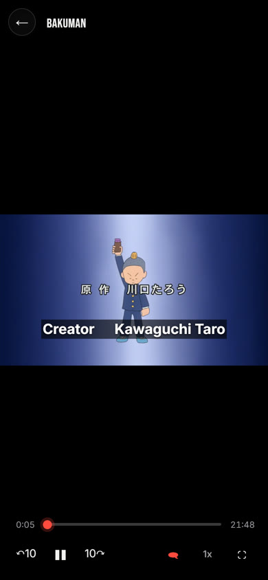
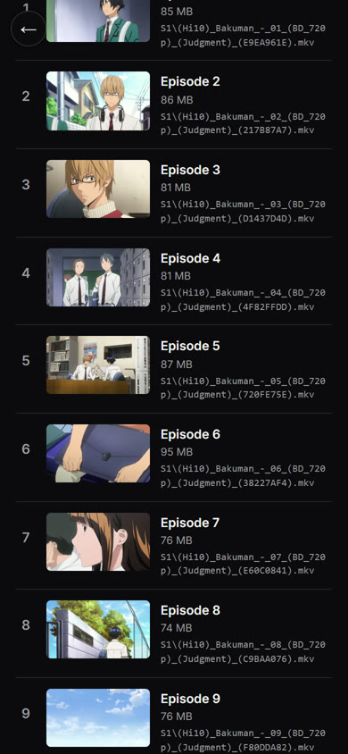

# Notflix

Your own personal Netflix. It runs on your Windows PC, scans every drive for
videos, sorts them into Movies / TV Shows / Anime / Home Videos, and streams
them to your phone over your home WiFi. Add it to your phone's home screen
and it opens full-screen like a real app.

## What it looks like

<table>
<tr>
<td width="60%" valign="top">

**On your PC** — a proper browsing experience: a featured hero, a My List row,
Continue watching with progress bars, and every category as its own shelf.



</td>
<td width="40%" valign="top">

**On your phone** — a sidebar for navigation, and a back button that stays
put no matter how far you scroll down a long episode list.



</td>
</tr>
<tr>
<td valign="top">



*Every title shows exactly where it lives on disk.*

</td>
<td valign="top">



*☰ opens a sidebar with every category and My List.*

</td>
</tr>
<tr>
<td valign="top">



*Subtitles render as real text tracks — switchable mid-episode.*

</td>
<td valign="top">



*The back button floats — it's still there after scrolling past episode 8.*

</td>
</tr>
</table>

---

## Quick start

1. Install [Node.js](https://nodejs.org) (LTS).
2. `npm install`, then set a PIN in `config.js`.
3. `npm start` — it scans your PC automatically on first run.
4. On your phone, open `http://notflix.local:7777` and add it to your home
   screen.

The sections below walk through each step in full.

**Jump to:** [Install](#1-install-nodejs-one-time) ·
[Setup](#4-install--start) ·
[Phone](#5-open-it-on-your-phone) ·
[Everyday use](#everyday-use) ·
[How sorting works](#how-it-decides-whats-a-movie-a-show-or-anime) ·
[Subtitles](#subtitles) ·
[Config](#customizing) ·
[Player](#player-controls) ·
[Limits](#notes--limits)

---

## 1. Install Node.js (one-time)

Notflix needs Node.js to run.

1. Go to https://nodejs.org and download the **LTS** version for Windows.
2. Run the installer, click through with defaults.
3. Confirm it worked: open **Command Prompt** and run:
   ```
   node -v
   ```
   You should see something like `v20.x.x`.

## 2. Get Notflix onto your PC

Unzip this `notflix` folder anywhere you like, e.g. `C:\Notflix`.

## 3. Set your PIN

Open `config.js` in Notepad and change this line to a PIN you'll remember:
```js
PIN: "1234",
```
Save the file.

## 4. Install & start

Open Command Prompt **inside the notflix folder** (tip: in File Explorer,
click the address bar, type `cmd`, hit Enter — it opens Command Prompt
already in that folder) and run:

```
npm install
npm start
```

The first time you run it, Notflix scans your entire PC for videos — this
can take a few minutes depending on how much you have. You'll see progress
in the console, and it also shows up in the app itself ("Scanning your PC
for videos..."). Thumbnails generate afterward, in the background, so you
can start browsing right away.

You'll see something like:

```
NOTFLIX is running.

On this PC:      http://localhost:7777
On your phone:   http://192.168.1.42:7777

PIN: 1234
```

Leave this window open — closing it stops the server.

## 5. Open it on your phone

1. Make sure your phone is on the **same WiFi network** as your PC.
2. Open Safari (iPhone) or Chrome (Android) and go to:

   ```
   http://notflix.local:7777
   ```

3. Enter your PIN.
4. **Add it to your home screen:**
   - **iPhone (Safari):** tap the Share icon → "Add to Home Screen"
   - **Android (Chrome):** tap the ⋮ menu → "Add to Home screen" /
     "Install app"

From now on, tapping the Notflix icon opens it full-screen like a real app —
no browser bars, no address typing.

### Use the name, not the IP address

Your router hands your PC a new IP every so often. A home-screen icon
remembers the exact address it was added from, so when the IP moves the icon
stops working and you have to delete and re-add it.

`notflix.local` avoids that. Notflix answers to that name on your home network
and replies with whatever IP it currently has, so **the address on your phone
never has to change again.** There is nothing to configure on your router.
It works on iPhone out of the box, and on Android 12 and newer.

The console still prints the raw `http://192.168.x.x:7777` address as a
fallback — use it if you ever need it, but don't save that one to your home
screen.

Change the name in `config.js` (`HOSTNAME`) if you'd rather it were something
else, or set `MDNS_ENABLED: false` to switch it off and use the IP only.

> **If `notflix.local` doesn't load:** check Windows Firewall is allowing
> Node.js on **private networks** — the name lookup uses UDP port 5353, which
> is separate from the port the site itself runs on. Older Androids (11 and
> below) can't resolve `.local` names at all; on those, use the IP address and
> set up a DHCP reservation for your PC in your router so the IP stops moving.

## Everyday use

- **Start it:** double-click `start.bat` (or run `npm start` from Command
  Prompt) any time you want to watch. Your phone home-screen icon will just
  work once the server is running, whatever IP your PC picked up this time.
- **Browse:** the tabs across the top filter to one category; tapping a card
  opens the title, where a series lists its seasons and episodes.
- **Search:** the magnifier in the top bar searches every title by name.
- **My List:** open anything and tap **My List** to keep it for later. Saved
  titles get their own row at the top of the home screen, a "My List"
  destination of their own, and a small tick on their card. Like watch
  progress, the list lives on your PC, so saving something on your phone puts
  it on your PC too.
- **On your phone:** the ☰ button opens a sidebar with Home, Search, My List
  and every category. Swipe it left, or tap outside it, to dismiss.
- **Getting back:** the back button on a title floats in the top-left and stays
  there however far down the episode list you scroll. You can also swipe in
  from the left edge of the screen to go back.
- **Rescan:** tap "⟳" in the top bar any time after adding new
  videos to your PC — no restart needed.
- **Resume watching:** Notflix remembers where you left off and shows a
  "Continue watching" row. Progress is stored **on your PC, not in the
  browser**, so stopping an episode on your PC and opening Notflix on your
  phone picks up in the same place (and the other way round). The row shows
  the exact episode you stopped on and how much is left.

## How it decides what's a Movie, a Show, or Anime

Notflix has no internet metadata lookup - it's all local and private. It works
out what everything is from the filename, the folder it lives in, and what
else is sitting on disk beside it.

**Episodes get grouped into series.** `S01E02`, `1x02`, `Episode 4`, the
fansub `- 07 -` convention and even a bare `01.mkv` are all recognised. The
show's name comes from whichever of the filename or the folder chain is more
informative, with a whole folder of files voting on the answer:

- `F:\Bakuman\S1\Bakuman 01.mkv` - the folder names the show, `S1` is a season
- `F:\DTB\Darker Than Black Complete Series\DTB - 01.mp4` - the folder is an
  acronym, so the fuller name from the box folder wins
- `D:\Violet Evergarden Violet Evergarden\`, ` OVA ...\` - numbered parts
  of one show, not four separate shows

**Categories** are Movies, TV Shows, Anime, Clips (your own gameplay and
screen captures) and Other. Anime detection is scored rather than
all-or-nothing: fansub group tags, CRC32 hashes in the filename, `[BD]`,
romanised Japanese, `OVA`/`NCOP` and so on each add weight. Shows that give
nothing away on their own get one more vote - if most of the shows sharing a
folder are clearly anime, the quiet ones are too. That's what puts
`Attack On Titan Episode 1 English Dubbed.mp4` in the right row.

**Things that are not entertainment get left out:**

- **Videos from games** - menu loops, splash screens, cutscenes and
  visual-novel scene files. A folder is recognised as a game install by what
  is in it (a `.exe` beside a Unity `_Data` folder, an Unreal `Content\Movies`
  tree, a Ren'Py `game\` folder, `steamapps`, Riot/Epic/GOG launcher paths),
  and the whole subtree is then skipped.
- **Code projects** - a folder with a `package.json`, `.sln` or similar is a
  project, so its hero videos and test footage stay out.
- **TypeScript files.** `.ts` is both "MPEG transport stream" and
  "TypeScript", so Notflix reads the first few bytes and only accepts the file
  if it really is video.
- **Hidden files and folders.** Windows stores "hidden" as a file attribute
  rather than a leading dot, which an ordinary directory listing cannot see,
  so Notflix asks Windows directly. Anything marked Hidden or System - or
  sitting inside a folder that is - stays out of the library.

**The scan is repeatable.** Folder listings come back in whatever order the
filesystem feels like, which would mean the same drive could sort differently
from one scan to the next. Notflix sorts every listing itself, and every
decision that could otherwise go either way - which name a folder votes for,
which of two identical rips wins - has a fixed tiebreak. Scanning an unchanged
drive twice produces identical results, so nothing moves around on you.

It won't be perfect for oddly-named files - rename the ones that matter and
rescan.

## Subtitles

Subtitles are found in two places and both are offered in the same picker:

- **Embedded in the video** - the ASS tracks in anime releases, the SubRip
  tracks in most MKV rips.
- **Sidecar files next to it** - `Movie.eng.srt`, a `Subs\` folder,
  `Brazilian.por.srt`, `SDH.eng.srt` and the other common layouts.

They're converted to WebVTT the moment you ask for one (a second or two the
first time, cached afterwards) and attached as real subtitle tracks, so you
can switch languages or turn them off mid-episode without restarting
playback. Sidecar files that aren't UTF-8 are decoded as Windows-1252 rather
than turning into mojibake.

Tap the speech-bubble button in the player to choose a track. Your choice is
remembered **by language**, so picking English once carries to the next
episode even though it's a different file with different track numbering.

Two limits worth knowing:

- Converting ASS to WebVTT keeps the timing and the words but drops the
  styling, so anime karaoke and positioned sign translations render as plain
  text at the bottom.
- Image-based subtitles (PGS, VOBSUB) are pictures, not text, so they cannot
  become WebVTT. They're listed separately in the picker with a note.

Set `SUBTITLE_DEFAULT_LANGUAGE` in `config.js` to pick a track automatically,
or `null` to always start with subtitles off.

## Customizing

Everything is in `config.js`:

- `PIN` — your login PIN
- `PORT` — change if 7777 is already used by something else
- `SCAN_ROOTS` — leave empty to scan every drive, or list specific folders
  to scan only those (much faster if your library lives in one place)
- `EXCLUDE_DIR_NAMES` — folders to always skip during scanning
- `EXCLUDE_PATHS` — specific folders or files to keep out of the library
  entirely, e.g. `["G:\Private"]`. Everything underneath a listed folder is
  excluded too.
- `EXCLUDE_HIDDEN` — skip anything marked Hidden or System in Windows (on by
  default)
- `EXCLUDE_GAME_VIDEOS` / `EXCLUDE_CODE_PROJECTS` — the game-install and
  code-project filters described above
- `CATEGORIES` — which rows appear on the home screen. Anything in a category
  you switch off lands in "Other" instead, so nothing is ever lost. Turn on
  `"Home Videos"`, `"Tutorials"` or `"Music Videos"` to give them their own row.
- `SUBTITLES_ENABLED` / `SUBTITLE_DEFAULT_LANGUAGE` — see Subtitles above
- `THUMBNAIL_ENABLED` — turn thumbnail generation off if you don't want it

Restart the server (`Ctrl+C` then `npm start`) after editing `config.js`.

## Why some videos need converting (and what that means)

iPhones can only play a narrow set of formats: H.264 video with AAC audio in
an MP4 container. This applies to Chrome on iPhone too, because on iOS every
browser is required to use Safari's engine underneath. That is why a file can
play instantly on your PC and hang forever on your phone.

Notflix handles this automatically:

- **Already compatible** (H.264/AAC in .mp4, .m4v, .mov): streamed directly,
  no conversion, no CPU cost.
- **Everything else** (most .mkv, .avi, older codecs): converted on the fly.

The conversion happens in short chunks, produced only as the player needs
them, so playback starts in a few seconds instead of waiting for a whole
file. You can also seek anywhere immediately. Converted chunks are cached, so
rewatching costs nothing.

You'll briefly see a message like "Converting MPEG4 for your device" the first
time a file plays. That's expected.

**If playback stutters on converted files,** your PC can't encode fast enough.
Open `config.js` and either lower `TRANSCODE_MAX_HEIGHT` (720 to 480) or set
`TRANSCODE_PRESET` to `"ultrafast"`. Both trade some quality for speed.

## Player controls

- **Tap** the video to show or hide the controls
- **Double-tap** the left or right side to jump back or forward 10 seconds
- **Skip buttons**, a scrubbable progress bar, playback speed, and fullscreen
  are all in the bottom bar
- **Subtitles**: the speech-bubble button lists every track it found, plus Off
- **Next episode** appears over the closing credits, and plays automatically
  when an episode ends
- **Keyboard** (on PC): space to play/pause, arrow keys to seek and change
  volume, `f` for fullscreen, `m` to mute, `c` for subtitles, `n` for the next
  episode, `Esc` to close

## Where things came from

Open any title and it shows the file or folder it came from on disk, right
under the Play button. For a series each episode also lists its own path
relative to that folder, so it's obvious which season folder an episode is
actually in. Tapping either copies the full path.

## Notes & limits

- This is built for **home WiFi only** — there's no remote/outside-network
  access, on purpose, to keep it simple and private. (If you want that
  later, it's addable via something like Tailscale — ask and I'll wire it
  up.)
- The full-drive scan skips common system folders (Windows, Program Files,
  ProgramData, etc.) automatically, but a genuinely huge drive can still
  take a while on first run. Narrowing `SCAN_ROOTS` to your actual video
  folders speeds this up a lot.
- Thumbnails and conversion both use a bundled `ffmpeg`, so there is nothing
  extra to install.
- Converting video is CPU-heavy by nature. One person watching one converted
  file is fine on any modern PC. Several people watching several converted
  files at once will push an older machine hard.
- Cached converted chunks live in `data/hls` and are cleaned up after 14 days
  (`HLS_CACHE_DAYS` in `config.js`). Deleting that folder is always safe.
- My List lives in `data/watchlist.json`. Entries store the title's name as
  well as its id, so renaming a show or moving a movie's file repairs the entry
  rather than losing it. Deleting the file just empties the list.
- Watch progress lives in `data/progress.json`, written the moment it changes
  (to a temp file, then renamed, so a shutdown mid-write can never corrupt it).
  Pulling the plug loses at most the last few seconds of position, never the
  whole history. Deleting the file just clears the Continue watching row. Because there is one PIN there is one shared history,
  which is what makes handing off between your devices work - it is not
  designed for several people with separate watchlists.
- A title only enters Continue watching after about 15 seconds of playback, and
  leaves it once you are within 20 seconds of the end.
- If a drive is unplugged or asleep during a scan, its shows drop off the home
  screen but their progress is kept, and comes back with the drive.
